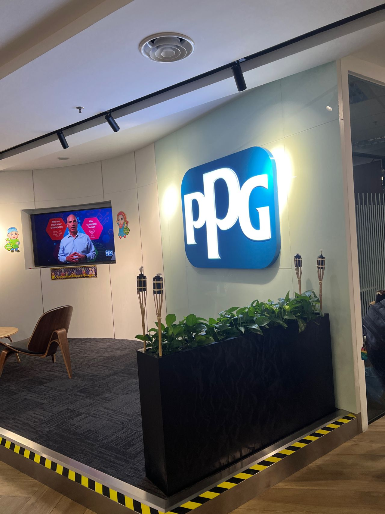
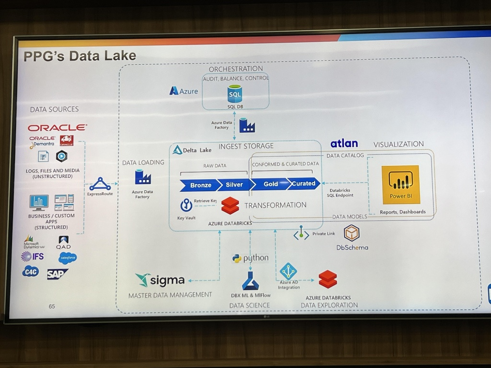
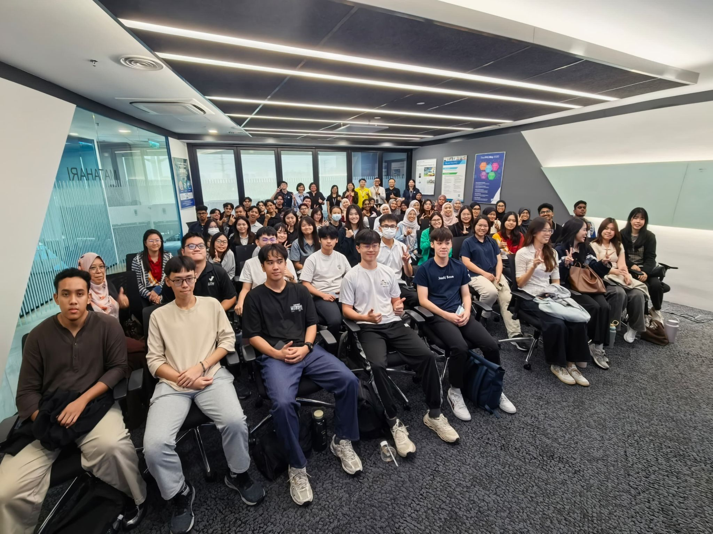

# Industrial Visit to PPG - Personal Reflection

## Overview
I participated in an industrial visit to PPG as part of my "Special Topic in Data Engineering" course. It was an eye-opening experience to see how a global manufacturing company manages its data architecture in the real world.

---

## What I Learned
During the visit, the technical team shared their data infrastructure, which gave me a much clearer understanding of enterprise-level data engineering:

* **PPG's Data Lake Architecture:** I saw firsthand how raw data from different sources (like SAP and Oracle) is collected and processed.
* **The Medallion Framework:** It was fascinating to see how they use **Azure Databricks** to clean and organize data through **Bronze, Silver, and Gold** stages.
* **Data Governance & Orchestration:** They utilize **Azure Data Factory** for managing data workflows and **Atlan** for data cataloging to keep everything secure and organized.

### Architecture Overview
Below is the data lake architecture presented during our visit:

---

## Key Takeaways & Appreciation
This visit perfectly bridged the gap between what I learn in class and how it is actually applied in the industry. It showed me the high demand for scalable data pipelines and strong data governance.

A huge thank you to the PPG staff for hosting us, and a special thanks to the senior interns and full-timers who spent time sharing their career advice and journey with us!

---
