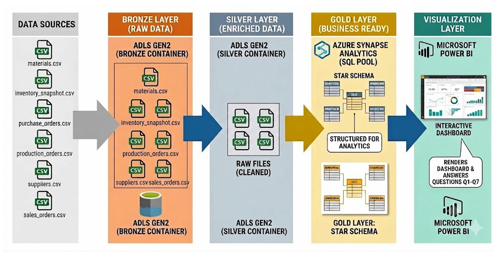
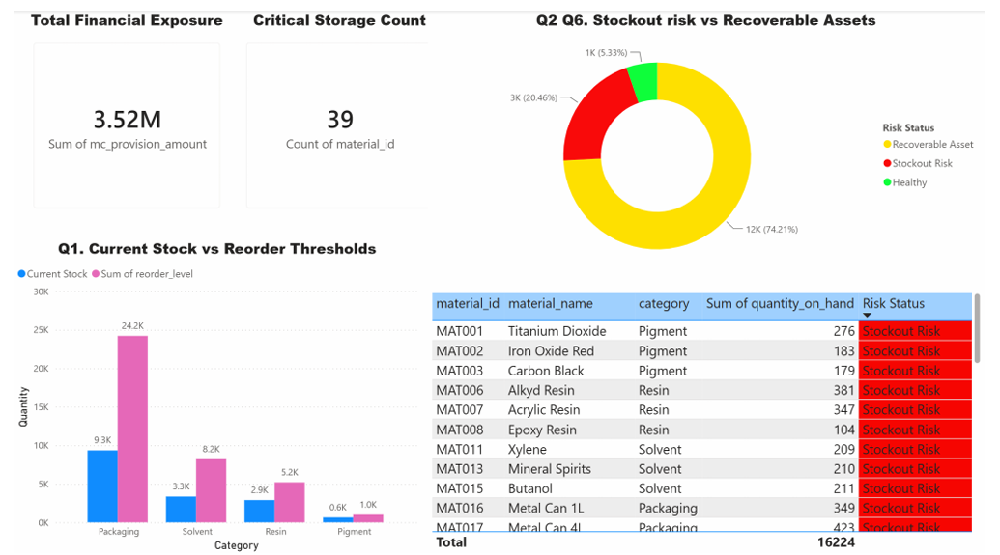
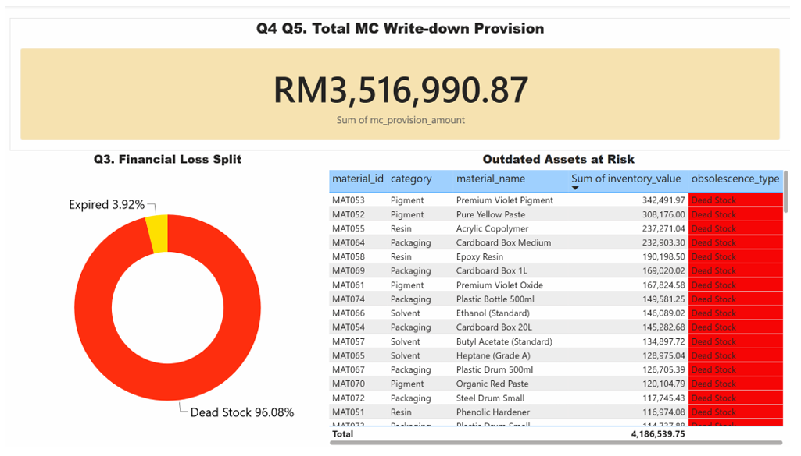
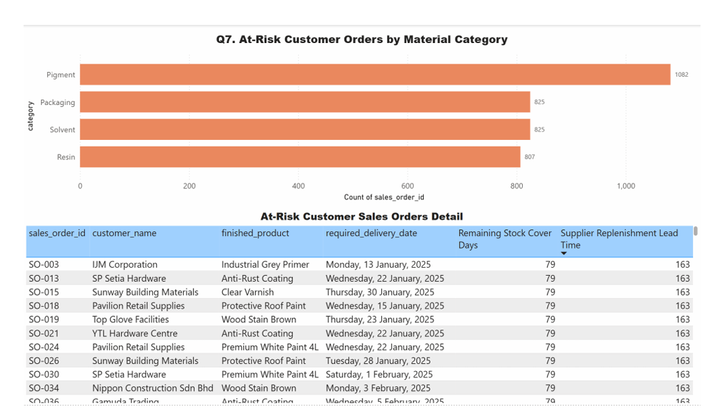

# 🏭 Project PPG: Recoverable Assets & Inventory Risk Management

Welcome to **Project PPG**, a comprehensive data engineering and business intelligence solution designed to tackle real-world supply chain challenges! 🚀

## 📖 About the Project
In the fast-paced global coating and paints industry, managing raw material inventory is a high-stakes challenge. PPG faced significant hurdles with inventory obsolescence, leading to financial losses from excess stock, dead stock, and expired materials. Furthermore, the lack of an integrated data pipeline across different departments made it difficult to predict stockout risks, which jeopardized customer order fulfillment.

To solve this, our team built an automated, cloud-based data engineering pipeline using **Microsoft Azure** and **Power BI**. The system ingests, cleans, and transforms raw operational data, applying complex business logic to identify:
* **Recoverable Assets (RA):** Materials with over 12 months of stock.
* **Magna Carta (MC) Dead Stock:** Materials with zero usage for over 9 months.
* **MC Expired Materials:** Chemical lots that have passed their expiration date.

Our end goal? To provide stakeholders with an interactive, unified dashboard that tracks financial exposure, calculates 100% write-down provisions, and flags stockouts before they delay customer deliveries!

---

## 📸 System Architecture & Dashboards

### End-to-End Medallion Architecture

### Power BI Dashboards
Our Power BI solution is divided into three comprehensive pages to provide targeted insights:

**1. Inventory Risk Overview**

> **Briefing:** Designed for high-level executive visibility, this dashboard provides a comprehensive view of total inventory value and overall financial exposure. It quickly highlights the volume of Recoverable Assets (RA) and allows stakeholders to pinpoint which warehouses or material categories are holding the most excess stock, driving better overall inventory balancing.

**2. Magna Carta (MC) Obsolescence Analysis**

> **Briefing:** Built specifically for the finance team, this dashboard zeroes in on materials requiring financial write-downs. It automatically flags dead stock (>9 months no usage) and expired lots, ranking them by inventory value. This layout makes it straightforward to distinguish the most costly obsolete materials and instantly quantify the 100% provision amounts needed.

**3. Supply Chain Stockout Alert**

> **Briefing:** A critical operational tool for the supply chain and fulfillment teams. This page flags materials with dangerously low stock levels and traces them directly to impacted customer sales orders. By calculating exactly when current stock will run out compared to when new shipments arrive, the team can prioritize replenishment actions and proactively prevent delivery failures.

---

## 🚀 Project Progress & Pipeline Features
We successfully implemented a **Medallion Architecture** to streamline data processing from raw ingestion to actionable insights:

* **🥉 Bronze Layer:** Automated data ingestion of 6 raw CSV datasets (materials, inventory snapshots, purchase orders, production orders, sales orders, suppliers) into Azure Data Lake Gen2 using **Azure Data Factory**.
* **🥈 Silver Layer:** Leveraged **PySpark in Azure Synapse Analytics** to cleanse data, handle nulls, remove duplicates, and apply critical business logic (RA metrics and MC compliance rules).
* **🥇 Gold Layer:** Organized the refined data into a highly optimized **Star Schema** (one central fact table and four dimension tables) for fast, reliable querying.
* **📊 Visualization:** Connected the Gold Layer to **Microsoft Power BI** via Serverless SQL views to create interactive, dynamic dashboards that answer key business questions (Q1-Q7).

This automated pipeline completely replaces the old manual, error-prone spreadsheet processes, transforming them into a centralized risk management engine! 🛠️

---

## 💡 Reflection

### What I Gained:
* **Cloud Data Engineering Mastery:** Hands-on experience building a robust, end-to-end data pipeline using the Microsoft Azure ecosystem (Data Factory, Data Lake Storage Gen2, Synapse Analytics).
* **Business Logic Implementation:** Learned how to translate complex business requirements (like Magna Carta rules for inventory obsolescence) into programmatic PySpark transformations.
* **Advanced Data Modeling:** Deepened my understanding of designing dimensional Star Schemas tailored for high-performance analytical queries and business intelligence.
* **Data Visualization Skills:** Gained practical skills in connecting cloud data warehouses to Power BI, designing impactful, user-centric dashboards for different organizational departments.

### Suggested Improvements & Problem-Solving:
* **Real-Time Data Integration:** The current pipeline processes batch CSV data. A major improvement would be to integrate real-time streaming directly from the ERP systems (using tools like Azure Event Hubs) to provide up-to-the-minute stockout alerts and immediate fulfillment tracing.
* **Predictive Analytics:** We could integrate Azure Machine Learning to forecast future inventory consumption patterns based on historical data, shifting the system from reactive dead-stock identification to proactive procurement planning.
* **Solving Data Anomalies:** During development, we encountered challenges with missing lot expiration dates and inconsistent identifiers which caused calculation failures. We solved this by engineering a robust Silver Layer transformation that applied a fallback token (`9999-12-31`) for null dates and created quarantine channels for bad data, ensuring the pipeline ran smoothly without data loss.
