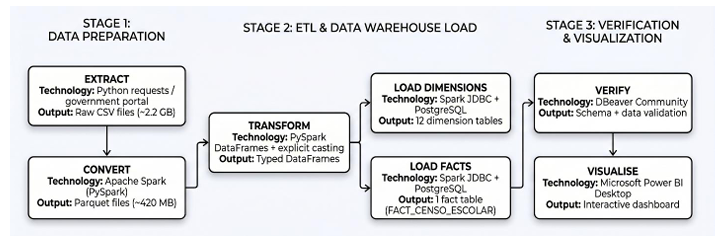
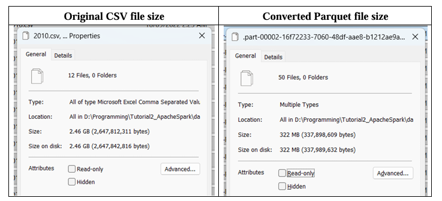
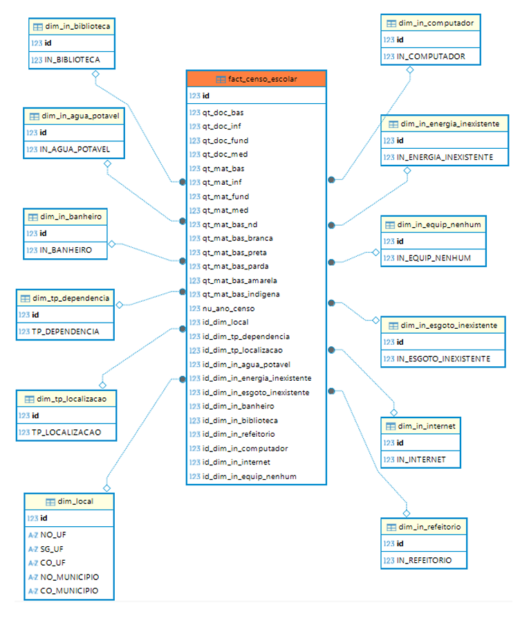
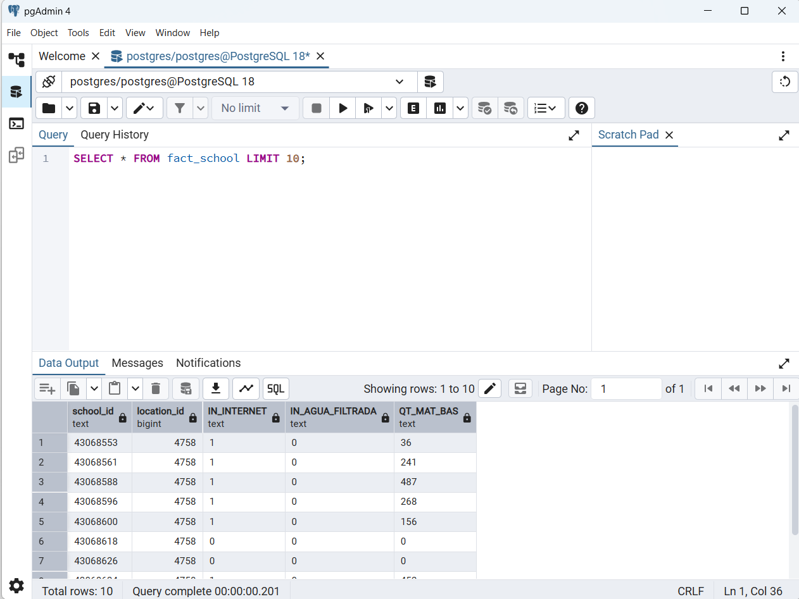
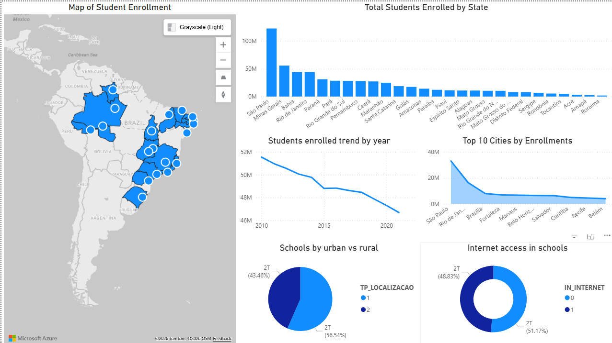

# 🚀 End-to-End Data Engineering ETL Pipeline: Apache Spark & PostgreSQL

An automated, large-scale ETL (Extract, Transform, Load) pipeline built to process over 2.2 GB of Brazilian School Census (Censo Escolar) microdata. This project demonstrates distributed data processing using **Apache Spark**, relational data modeling using **PostgreSQL**, and business intelligence visualization using **Power BI**.

## 📌 Project Overview
Traditional data processing tools (like Pandas) struggle to handle gigabytes of raw educational records. This project leverages the distributed, in-memory processing power of Apache Spark to clean, reshape, and compress millions of rows of data, ultimately structuring it into a highly efficient **Star Schema** for fast analytical querying.

### 🛠️ Tech Stack
* **Processing Engine:** Apache Spark (PySpark)
* **Data Warehouse:** PostgreSQL (Containerized via Docker)
* **Language:** Python 3.11
* **Visualization:** Power BI
* **Database Management:** DBeaver / Adminer / pgAdmin
* **Environment:** Jupyter Notebook on Windows 11

---

## 🏗️ Pipeline Architecture

### 1. Extract (E)
* Programmatically downloaded massive `.zip` files containing raw `.csv` microdata from the Brazilian Open Data Portal using the Python `requests` library.
* Automated the extraction and bypassed strict SSL configurations to securely land the raw data in a local directory.

### 2. Transform (T)
* **Data Ingestion:** Loaded the multi-gigabyte CSV into a Spark DataFrame, explicitly handling the Brazilian regional text encoding (`iso-8859-1`) and custom semicolon (`;`) delimiters.
* **Optimization:** Bypassed Spark's expensive `inferSchema` operation by explicitly casting data types, reducing initial load times drastically.
* **Data Compression:** Converted the heavy, raw CSV files into the **Apache Parquet** format. This columnar storage format reduced the data footprint from **~2.46 GB down to just ~322 MB**, vastly improving query speed.

### 3. Load (L)
* **Data Modeling:** Transformed the flat denormalized data into a relational **Star Schema**.
  * **Dimension Tables (12):** Isolated descriptive attributes (e.g., `dim_location`, `dim_internet`, `dim_water`) to remove redundancies and generate unique surrogate keys.
  * **Fact Table (1):** Built a central `fact_censo_escolar` table holding quantitative metrics (enrollment numbers, teacher counts) mapped to the dimension keys.

* **Database Injection:** Established a JDBC connection to push the transformed DataFrames directly into a local PostgreSQL instance.

### 4. Visualize (BI)
* Connected **Power BI Desktop** directly to the PostgreSQL warehouse.
* Built interactive dashboards utilizing cross-filtering to analyze enrollment trends, urban vs. rural school distribution, and internet accessibility across different Brazilian states and municipalities.

---

## 💡 Reflection

* **What I Gained:** Building this project provided me with hands-on experience in constructing a scalable, end-to-end data pipeline from scratch. I gained a deep understanding of how to leverage Apache Spark for large-scale data processing instead of relying on memory-limited tools like Pandas. Specifically, I learned how to programmatically extract raw CSV data, optimize storage and query performance by converting it into the columnar Parquet format, and design a relational Star Schema (comprising Fact and Dimension tables). Finally, I developed practical skills in integrating big data frameworks with traditional databases by successfully loading the transformed data into PostgreSQL using Spark JDBC connectors.

* **Suggested Improvements & Problem-Solving:** A significant portion of my learning came from troubleshooting environment-specific challenges while running PySpark natively on Windows. I successfully solved complex configuration issues, such as fixing "Python worker crashed" errors by strictly aligning the `PYSPARK_PYTHON` environment variables, bypassing SSL verification for government data extraction, and correcting JDBC driver URI pathing. To improve this pipeline in the future, I suggest migrating the workload from a local machine to a cloud-based distributed cluster (such as Azure Databricks) to fully utilize Spark's parallel processing power. Additionally, integrating an orchestration tool like Apache Airflow would be a great next step to fully automate the extraction and transformation schedules.
