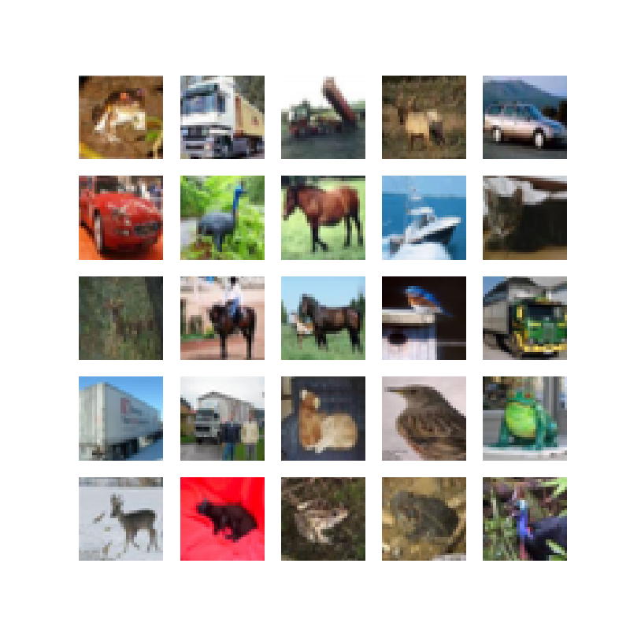
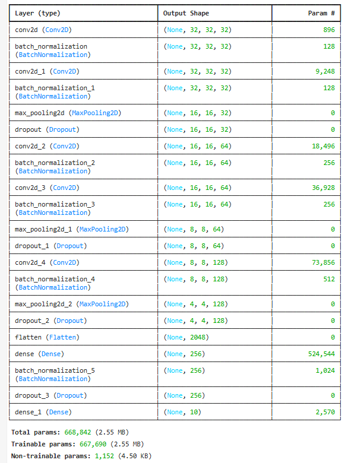
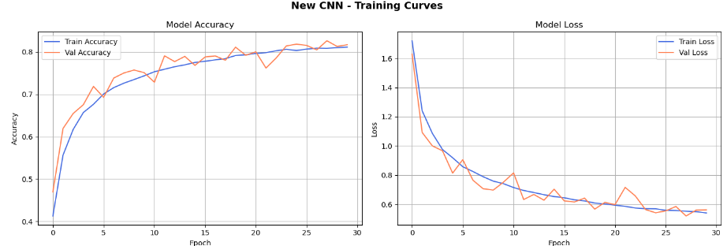
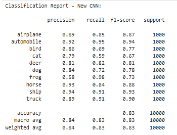

# 🧠 Image Classification with Convolutional Neural Networks (CNN)

A Deep Learning project focused on building, evaluating, and optimizing computer vision models to classify images from the CIFAR-10 dataset. This project demonstrates the architectural advantages of Convolutional Neural Networks (CNNs) over traditional Artificial Neural Networks (ANNs) and explores advanced model tuning techniques to prevent overfitting.

## 📌 Project Overview
Computer vision tasks require models that can understand spatial relationships within an image. This project compares a baseline ANN (which flattens images and loses spatial context) against a CNN (which uses 2D filters to scan for features like edges and textures). By implementing model optimizations, we achieved massive improvements in mathematical confidence, feature recognition, and generalization.

### 🛠️ Tech Stack
* **Framework:** TensorFlow / Keras (Python)
* **Neural Network Layers:** Dense, Conv2D, MaxPooling2D, Dropout
* **Optimization Algorithm:** Adam Optimizer
* **Data Processing:** Data Augmentation (Flipping, Zooming)

---

## 🏗️ Pipeline & Architecture

### 1. The Dataset (CIFAR-10)
* Utilized the standard CIFAR-10 dataset, consisting of **50,000 training images** distributed across 10 distinct categories (e.g., cats, dogs, frogs, automobiles, ships, trucks).

### 2. Data Preprocessing
* **Normalization:** Scaled pixel values by dividing by `255.0` to compress the RGB data into a `0 to 1` scale, allowing the neural network to converge and learn significantly faster.

### 3. Model Comparison
* **Baseline ANN:** Built a standard Artificial Neural Network by flattening the 2D images into a 1D array. As expected, this model struggled to understand spatial relationships, topping out at around **49% accuracy**.
* **Transition to CNN:** Replaced the flat architecture with `Conv2D` and `MaxPooling2D` layers. By preserving the image's overall layout and scanning for distinct features, the baseline CNN immediately bumped the accuracy to **~70%**.

---

## 🚀 Advanced Optimization & Results

To push the model beyond its baseline performance and cure initial issues with overfitting, several advanced techniques were applied:

### 🛠️ Techniques Applied:
* **Dropout Layers:** Forced the network to not rely on single neural pathways, distributing the learning more evenly across the model.
* **Data Augmentation:** Introduced random transformations (flipping and zooming) to the training images. This forced the model to learn the actual *concepts* of the objects rather than just memorizing the training set.

### 📊 Final Outcomes:
* **Near-Perfect Vehicle Classification:** The modified CNN pushed vehicle categories to near-saturation. The model now classifies automobiles, ships, and trucks with massive precision, hitting **0.85 to 0.90 F1-scores**.
* **Improved Animal Recognition:** The model successfully learned high-level features (like ear shapes and snout lengths), resulting in much higher F1-scores for cats and dogs.
* **Massive Confidence Boost:** Test loss was cut almost in half, dropping from `~0.90` down to `~0.48`. This proves the model is making its predictions with a vastly higher degree of mathematical stability.
* **Zero Overfitting:** The model successfully generalizes to new, unseen test images without memorizing the original dataset.

---

## 💡 Reflection

* **What I Gained:** Completing this tutorial provided me with a highly practical understanding of the deep learning workflow. I learned exactly why traditional ANNs fail at image classification due to spatial data loss, and how Convolutional Neural Networks solve this by scanning for 2D features. Furthermore, I mastered essential model optimization skills—such as applying Dropout and Data Augmentation—to successfully cure overfitting and stabilize the mathematical confidence of my predictions.
* 
* **Suggested Improvements & Problem-Solving:** Working with the CIFAR-10 dataset was great for learning, as the academic dataset is already perfectly neat, standardized, and organized. However, in the real world, image data is messy and unstructured. A major improvement to this pipeline would be integrating robust data engineering tools to automatically collect, clean, and standardize raw images before they are fed to the AI. Finally, an excellent next step would be taking this optimized computer vision model and deploying it to an edge computing platform.

---
