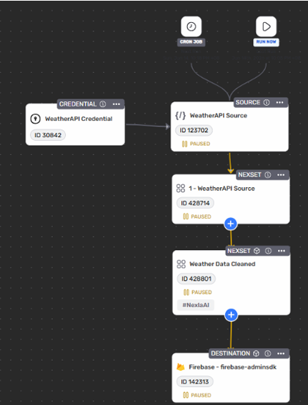
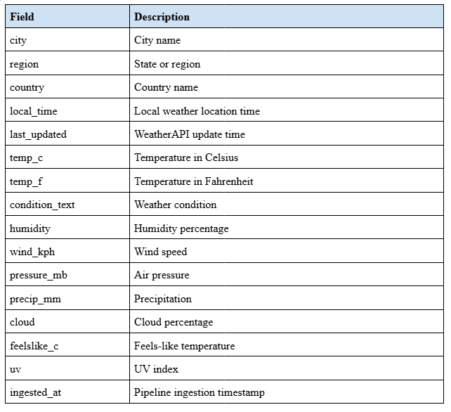
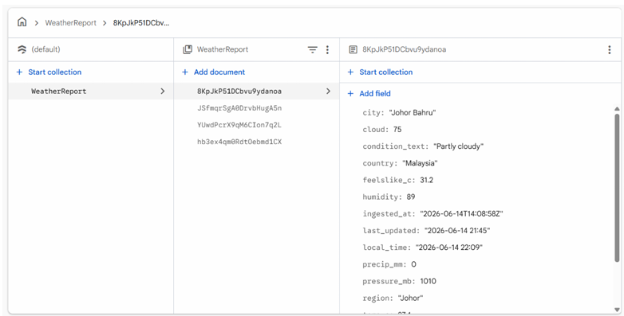

# Tutorial 4 – AI-Assisted ETL Data Pipeline Using an AI Agent

## 📌 Project Overview

This project demonstrates how an AI Agent can be used to design and build a complete ETL (Extract, Transform, Load) data pipeline through natural language prompts. The pipeline extracts real-time weather information from WeatherAPI.com, transforms the raw nested JSON response into a clean and structured format, and loads the processed data into Firebase Firestore for storage and future analysis.

---


## 🎯 Objectives

The main objectives of this tutorial are:

- Understand the concept of AI-Assisted Data Engineering.
- Learn how AI Agents can automate ETL pipeline development.
- Extract real-time weather data from WeatherAPI.com.
- Transform nested JSON responses into a flattened structure.
- Load transformed data into Firebase Firestore.
- Automate data collection using scheduled executions (Cron Jobs).
- Evaluate the strengths and limitations of AI-generated pipelines.

---

## 🏗️ System Architecture

```text
WeatherAPI.com
       │
       ▼
 ┌──────────┐
 │ Extract  │
 └──────────┘
       │
       ▼
 ┌──────────┐
 │Transform │
 │ Flatten  │
 │  JSON    │
 └──────────┘
       │
       ▼
 ┌──────────┐
 │   Load   │
 │ Firebase │
 │Firestore │
 └──────────┘
       │
       ▼
 Stored Weather Records
```

---

## 🔄 ETL Pipeline Workflow

### 1️⃣ Extract

The pipeline retrieves current weather information from WeatherAPI.com for Johor Bahru, Malaysia.

Extracted attributes include:

- City
- Region
- Country
- Temperature
- Humidity
- Wind Speed
- Weather Condition
- Pressure
- Cloud Coverage
- UV Index
- Precipitation

---

### 2️⃣ Transform

The WeatherAPI response contains nested JSON structures.

The AI Agent generated transformation logic to flatten the response into a clean structure suitable for storage and analysis.

#### Example Output Fields

| Field | Description |
|---------|---------|
| city | City Name |
| region | Region |
| country | Country |
| local_time | Local Time |
| temp_c | Temperature (°C) |
| temp_f | Temperature (°F) |
| humidity | Humidity Percentage |
| wind_kph | Wind Speed |
| pressure_mb | Air Pressure |
| cloud | Cloud Coverage |
| uv | UV Index |
| ingested_at | Pipeline Timestamp |

---

### 3️⃣ Load

The transformed records are stored in:

| Component | Value |
|------------|------------|
| Database | Firebase Firestore |
| Project | auto-weather-fetch |
| Collection | weatherReport |
| Storage Type | Document-Based NoSQL |

Each pipeline execution inserts a new weather document into Firestore.

---

### 4️⃣ Schedule

The pipeline supports:

- **Run Now** (Manual Execution)
- **Cron Job** (Automated Execution)

Current configuration:

```text
Every 2 Minutes
```

This allows continuous collection of weather information over time.

---

## 🤖 AI Agent Responsibilities

The AI Agent assisted in:

- Creating WeatherAPI connections
- Validating API sources
- Discovering available attributes
- Generating transformation logic
- Suggesting Firestore as the destination
- Connecting all pipeline components
- Supporting automated execution scheduling

---

## 📝 Prompt Engineering

### Main Prompt

```text
I want to create an ETL data pipeline from WeatherAPI.com to a document-based database.
The pipeline should fetch current weather data for Johor Bahru, transform the response into a clean JSON format, and store each record in a database collection.
The pipeline should run every 2 minutes.
```

### Transformation Prompt

```text
Please clean the WeatherAPI response and extract only useful fields into a simple JSON structure:
city, region, country, local_time, last_updated, temp_c, temp_f,
condition_text, humidity, wind_kph, pressure_mb, precip_mm,
cloud, feelslike_c, uv, and ingested_at.
```

---

## 📊 Sample Output

```json
{
  "country": "Malaysia",
  "city": "Johor Bahru",
  "region": "Johor",
  "local_time": "2026-06-13 13:38",
  "last_updated": "2026-06-13 13:15",
  "temp_c": 32.2,
  "temp_f": 90,
  "condition_text": "Partly cloudy",
  "humidity": 71,
  "wind_kph": 6.8,
  "precip_mm": 0.55,
  "cloud": 75,
  "feelslike_c": 39.2,
  "uv": 9.3,
  "ingested_at": "2026-06-13T05:38:31Z"
}
```

---

# 📸 Project Screenshots

## AI Agent Pipeline Configuration



---

## Data Transformation Attribute



---

## Firebase Firestore Output



---

# 📈 Results

The ETL pipeline successfully:

✅ Extracted real-time weather data from WeatherAPI

✅ Converted nested JSON into a flattened structure

✅ Stored transformed records in Firebase Firestore

✅ Supported both manual and automated execution

✅ Generated multiple records through scheduled runs

---

# ⚠️ Challenges Encountered

### API Authentication Issues

Initially, the WeatherAPI key appeared invalid during configuration despite working correctly through browser testing.

**Solution:**
- Verified credential settings.
- Reconfigured API parameters.
- Tested endpoint responses independently.

---

### Firestore Data Formatting

The AI Agent initially generated standard JSON payloads that were incompatible with Firestore REST API requirements.

**Solution:**
- Customized transformation logic.
- Adjusted document structure.
- Applied Firestore-compatible formatting.

---

### AI Assumption Errors

The AI Agent occasionally made assumptions about database schemas and output formats.

**Solution:**
- Performed manual verification.
- Refined prompts with explicit requirements.
- Added iterative testing and debugging.

---

# 🚀 Future Enhancements

Potential improvements include:

- Collect weather data from multiple cities.
- Implement automated data quality validation.
- Add missing value detection.
- Create real-time dashboards.
- Develop weather alert notifications.
- Enhance prompt engineering strategies.
- Integrate monitoring and logging features.

---

# 🛠️ Technologies Used

- WeatherAPI.com
- AI Agent (Claude)
- Firebase Firestore
- JSON
- ETL Pipeline
- Cron Scheduling
- NoSQL Database

---

# 📚 Key Learning Outcomes

This tutorial provided valuable insights into the application of AI in data engineering workflows. Through the development of an AI-assisted ETL pipeline, we learned how artificial intelligence can significantly accelerate pipeline creation by generating configurations, transformation logic, and workflow structures from simple natural language prompts. At the same time, the project highlighted the importance of prompt engineering, as the quality and specificity of instructions directly influenced the accuracy of the generated pipeline. We also gained practical experience in transforming nested API responses into a structured format suitable for storage and analysis, while understanding the best practices for integrating external APIs with cloud-based databases such as Firebase Firestore. Most importantly, the tutorial demonstrated that although AI Agents can automate many development tasks, human validation remains essential to verify configurations, troubleshoot issues, and ensure the reliability of the final solution.

---

# 💡 Reflection

* **What I Gained:** This tutorial provided valuable insights into the application of AI in data engineering workflows. Through the development of an AI-assisted ETL pipeline, we learned how artificial intelligence can significantly accelerate pipeline creation by generating configurations, transformation logic, and workflow structures from simple natural language prompts. At the same time, the project highlighted the importance of prompt engineering, as the quality and specificity of instructions directly influenced the accuracy of the generated pipeline. We also gained practical experience in transforming nested API responses into a structured format suitable for storage and analysis, while understanding the best practices for integrating external APIs with cloud-based databases such as Firebase Firestore. Most importantly, the tutorial demonstrated that although AI Agents can automate many development tasks, human validation remains essential to verify configurations, troubleshoot issues, and ensure the reliability of the final solution.

* **Suggested Improvements & Problem-Solving:** Through this tutorial, I gained hands-on experience in building an end-to-end ETL pipeline with the assistance of an AI Agent. The project helped me understand how natural language prompts can be used to automate tasks such as data extraction, transformation, and loading, reducing the amount of manual configuration required. I also acquired practical knowledge of integrating WeatherAPI with Firebase Firestore and learned how to process and flatten nested JSON responses into a structured format suitable for storage. Additionally, the experience strengthened my prompt engineering skills, as I discovered that clear and detailed instructions are crucial for obtaining accurate AI-generated solutions. Most importantly, the project reinforced the need for human oversight when working with AI tools, as generated outputs still require validation, debugging, and refinement. Overall, this tutorial shifted my perspective from focusing solely on coding implementation to thinking more like a data architect who designs and manages complete data workflows.
